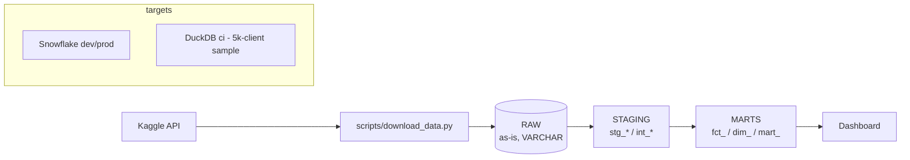

# credit-risk-pipeline

Production-style credit risk data pipeline built on the public
[Home Credit Default Risk](https://www.kaggle.com/competitions/home-credit-default-risk) dataset.

**Stack:** Snowflake (dev/prod) - dbt - Airflow - DuckDB (CI) - Python - GitHub Actions.

> Status: **Phase 4 of 5** - orchestration with Airflow done. Next: CI/CD, dbt docs, Metabase.

## Architecture (target)



## SCD2 snapshot: a simulation of monthly loads

`snp_loan_status` keeps the history of the contract status of POS / cash loans as an SCD2 table. **The
dataset is static, so this history is a simulation, not something the pipeline observed.** The history
that does exist (`pos_cash_balance.name_contract_status` for `months_balance` -96 to -1) is replayed one
month at a time by `scripts/replay_loan_status.py`, which runs `dbt snapshot --vars '{as_of_month: m}'` for
each month m, as if a new monthly load had arrived. `dbt_valid_from` / `dbt_valid_to` are therefore the
wall-clock times of the replay runs, **not business dates** (the dataset has no calendar dates); the
simulated business timeline is the `as_of_month` column. The replay is run by the `replay_loan_status` Airflow DAG (manual only); by default it replays the last 12 months (`start_month=-12`), and `-96` replays the whole history (one dbt run per month).

## Orchestration (Airflow)

Airflow 3.1 runs locally in Docker. Create `.env` first (`cp .env.example .env`) and set your own
`AIRFLOW__API_AUTH__JWT_SECRET` and `AIRFLOW__CORE__FERNET_KEY` (generation commands are in `.env.example`). Then one command starts it;
UI at http://localhost:8080, no login:

```bash
docker compose -f orchestration/airflow/docker-compose.yml up --build
```

There are two DAGs. Both take a `target` param (`ci` by default: DuckDB + the committed sample, no credentials;
`dev`/`prod` use Snowflake and the credentials in `.env`).

**`credit_risk_daily`** - scheduled `@daily`, created paused, `catchup=False`. Loads RAW and builds and tests the dbt project:

```
needs_download -> (skip_download | download_data) -> load_raw -> dbt_deps -> dbt_build -> verify
```

- `download_data` runs only for `dev`/`prod`; `ci` uses the committed sample.
- `load_raw` skips a table whose source file is unchanged: `RAW._LOAD_AUDIT` stores each table's sha256 and row count, and a table is
  skipped only if the hash matches and RAW still has that row count (`--force` reloads everything). The log shows
  `skipped: unchanged` per table.
- `dbt_build` is an [Astronomer Cosmos](https://astronomer.github.io/astronomer-cosmos/) task group: one Airflow task per
  dbt model and one per model's tests, so a failure points at a model and a rerun resumes from it. Tests with
  `severity: warn` are logged and do not fail the DAG; `severity: error` tests do.
- It excludes `snp_loan_status` and everything downstream of it (the snapshot and the tests that read it).
- `verify` checks that the marts are populated and that RAW, staging and marts reconcile.
- 2 retries with exponential backoff per task.

**`replay_loan_status`** - no schedule, manual trigger only. It is the *simulation* of monthly loads into the SCD2
snapshot: `replay_snapshot -> test_snapshot -> verify_snapshot`. Params: `start_month` (default -12), `end_month`
(default -1), `target` (default `ci`). It drops and rebuilds the snapshot, so it can be rerun; run `credit_risk_daily`
first on the same target.

For `dev`/`prod`, the scheduler (which runs the tasks) mounts `~/.snowflake` read-only at `/run/snowflake` and overrides
`SNOWFLAKE_PRIVATE_KEY_PATH` there (key file named `rsa_key.p8`; set `SNOWFLAKE_KEY_DIR` for another folder). The key is never copied into the image.
For Snowflake set `DBT_POOL_SLOTS=4` in `.env` before `up` (the dbt threads of `dev`).

dbt runs in its own virtualenv inside the image (its dependency pins conflict with Airflow's); Cosmos only needs the path
to its executable. Warehouse-writing tasks share the Airflow pool `dbt_warehouse` (1 slot by default because DuckDB allows
one writer; raise `DBT_POOL_SLOTS` in `.env` for Snowflake). DAG tests run inside the image:
`docker compose -f orchestration/airflow/docker-compose.yml run --rm --no-deps --entrypoint bash airflow-scheduler -c "cd /opt/project && pytest tests/test_dags.py"`.

## Repository layout

| Path | Purpose |
|---|---|
| `credit_risk_pipeline/` | Shared Python code (table registry, config, connections) |
| `scripts/` | CLI entry points: download, sample, load, Snowflake setup |
| `dbt/` | dbt project and `profiles.yml` (targets `dev`, `prod`, `ci`) |
| `orchestration/airflow/` | Airflow DAGs, Dockerfile and docker-compose |
| `data/sample/` | Deterministic 5,000-client sample used by CI |
| `docs/` | Data quality findings and design notes |
| `dashboard/` | Dashboard file (BI) |
| `.github/workflows/` | CI (phase 4) |

## Quickstart

```bash
uv venv --python 3.12 .venv && source .venv/bin/activate   # or: .venv\Scripts\activate
uv pip install -r requirements.txt
cp .env.example .env                                        # fill in values

# 1. Download the raw dataset (requires Kaggle credentials, see below)
python scripts/download_data.py

# 2. Build the deterministic CI sample (commit data/sample/)
python scripts/make_sample.py

# 3a. CI target: load the sample into DuckDB
python scripts/load_raw.py --target ci

# 3b. Snowflake: run scripts/snowflake_setup.sql once (ACCOUNTADMIN), then
python scripts/load_raw.py --target dev
```

### Kaggle access

1. Create an API token at Kaggle > Settings > API and save it as `~/.kaggle/kaggle.json`
   (or export `KAGGLE_USERNAME` / `KAGGLE_KEY`).
2. **Accept the competition rules** on the competition page (Rules tab > "I Understand and Accept").
   Without this the API answers 403 even with valid credentials.

### Snowflake access

Set the `SNOWFLAKE_*` variables from `.env.example`. Key-pair authentication is recommended
because password-only logins are being phased out on Snowflake accounts. No credential is ever
stored in the repository; `dbt/profiles.yml` reads everything from environment variables.

## Data model layers

| Layer | Schema | Contract |
|---|---|---|
| RAW | `RAW` | Source files loaded as-is: every column `VARCHAR`, plus `_loaded_at`, `_source_file`. Reloaded atomically. |
| STAGING | `STAGING` | Typed, renamed, deduplicated views (`stg_*`, `int_*`). |
| MARTS | `MARTS` | Business-ready facts, dimensions and risk marts. |

## Development

```bash
ruff check . && ruff format --check .
pytest
```
