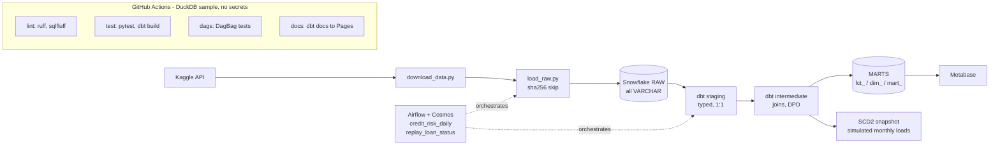
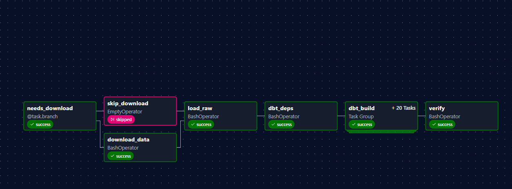
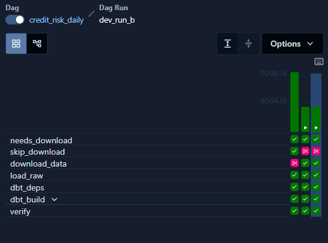
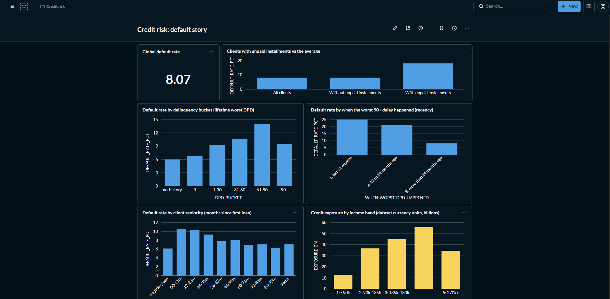
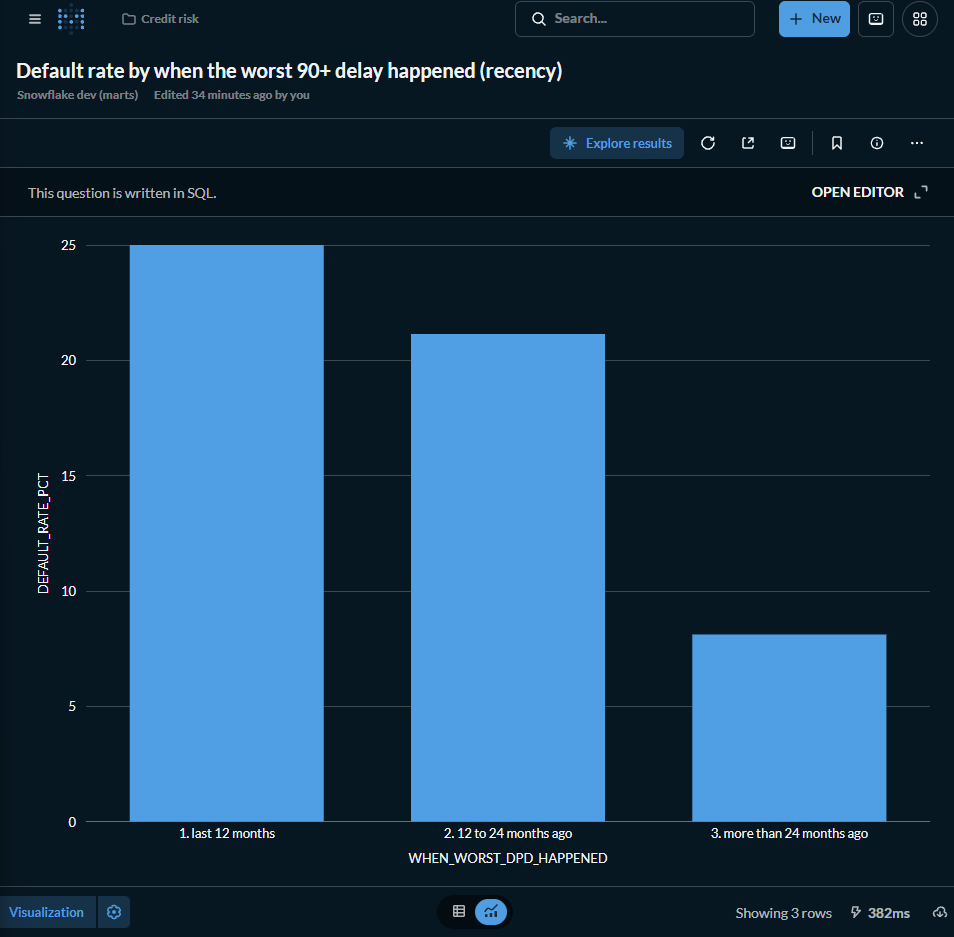

# credit-risk-pipeline

[](https://github.com/rondymercedes07/credit-risk-pipeline/actions/workflows/ci.yml)
[](https://rondymercedes07.github.io/credit-risk-pipeline/)

A production-style data pipeline for credit risk: it takes the public
[Home Credit Default Risk](https://www.kaggle.com/competitions/home-credit-default-risk) dataset (7 tables plus the `application_test` file, ~58M rows),
loads it into Snowflake, models it with dbt (typed staging, intermediate logic, risk marts, an SCD2 snapshot), tests it
(172 data tests, every failure on real data documented as a finding), orchestrates it with Airflow, and serves it in Metabase.
The same dbt project also runs for free on DuckDB with a 5,000-client sample, which is what CI uses.

**What the data says** (full dataset, Snowflake; queries in [`docs/headline_metrics.md`](docs/headline_metrics.md);
amounts are in *dataset currency units*, the source does not name a currency):

- **8.07% of clients defaulted** (24,825 of 307,511) on 184.2 billion dataset currency units of requested credit.
- **Clients with at least one unpaid installment default at 18.14%, 2.2 times the average** (1,075 clients).
- **The "90+ days late" bucket looks milder than "61-90" only because of recency:** if the worst delay was in the last
  12 months the default rate is 25.0% (164 clients, a small group), against 8.11% if it was more than 24 months earlier.

**Stack:** Snowflake (dev/prod) - dbt - Airflow with Astronomer Cosmos - DuckDB (CI) - Python - Metabase - GitHub Actions.

## Architecture



## Quick start

### 1. Free, no credentials: the `ci` target (DuckDB + committed sample)

```bash
uv venv --python 3.12 .venv && source .venv/bin/activate     # Windows: .venv\Scripts\activate
uv pip install -r requirements.txt
python scripts/load_raw.py --target ci && (cd dbt && dbt deps && dbt build --target ci --exclude "snp_loan_status+")
```

That loads the 5,000-client sample into `data/ci/credit_risk.duckdb` and runs every model and test (expected:
`PASS=179 WARN=7 ERROR=0`; the warns are documented findings. The snapshot and its 5 tests add 6 passes after the
replay: 185 pass, 7 warn, 0 error in total).

### 2. Airflow (Docker), still on the free target

```bash
cp .env.example .env     # then set AIRFLOW__API_AUTH__JWT_SECRET and AIRFLOW__CORE__FERNET_KEY (commands inside)
docker compose -f orchestration/airflow/docker-compose.yml up --build
```

UI at http://localhost:8080 (no login, local only). Unpause and trigger `credit_risk_daily`; the default target is `ci`.

### 3. Snowflake `dev` (full dataset)

1. Run `scripts/snowflake_setup.sql` once as `ACCOUNTADMIN` (database, schemas, XS warehouse with 60 s auto-suspend,
   resource monitor, dedicated role).
2. Create a key pair (`rsa_key.p8`, e.g. in `~/.snowflake/`) and set in `.env`: `SNOWFLAKE_ACCOUNT`, `SNOWFLAKE_USER`,
   `SNOWFLAKE_PRIVATE_KEY_PATH` (and `SNOWFLAKE_PRIVATE_KEY_PASSPHRASE` if the key is encrypted). No password needed.
3. Kaggle: save your token as `~/.kaggle/kaggle.json` and **accept the competition rules** on the competition page
   (otherwise the API answers 403). Then `python scripts/download_data.py` (~2.7 GB, never committed).
4. `python scripts/load_raw.py --target dev`, then `cd dbt && dbt build --target dev --exclude "snp_loan_status+"`.
   Or trigger `credit_risk_daily` with `target=dev` in Airflow.

In Docker, the scheduler mounts `~/.snowflake` read-only at `/run/snowflake` and overrides `SNOWFLAKE_PRIVATE_KEY_PATH`
there; the key is never copied into an image or the repo (set `SNOWFLAKE_KEY_DIR` for another folder). For `dev`/`prod`
raise the Airflow pool live (it defaults to 1 slot, safe for DuckDB):
`docker compose -f orchestration/airflow/docker-compose.yml exec airflow-scheduler airflow pools set dbt_warehouse 4 "dbt tasks"`,
and set it back to 1 before running `ci` again.

### 4. Metabase

`docker compose -f bi/metabase/docker-compose.yml up -d && python bi/metabase/setup.py`; see
[`bi/metabase/README.md`](bi/metabase/README.md).

## Orchestration (Airflow)

Two DAGs, both with a `target` param (`ci` by default).

**`credit_risk_daily`** - `@daily`, created paused, `catchup=False`, 2 retries with exponential backoff per task:

```
needs_download -> (skip_download | download_data) -> load_raw -> dbt_deps -> dbt_build -> verify
```

- `download_data` runs only if a file is missing from `data/raw` (never for `ci`, which uses the committed sample).
- `load_raw` skips a table whose source file is unchanged: `RAW._LOAD_AUDIT` stores each table's sha256 and row count, and
  a table is skipped only if the hash matches **and** RAW still has that row count. The log shows `skipped: unchanged`.
  `--force` reloads everything.
- `dbt_build` is an [Astronomer Cosmos](https://astronomer.github.io/astronomer-cosmos/) task group: one Airflow task per
  dbt model and one per model's tests, so a failure points at a model and a rerun resumes from it. Tests with
  `severity: warn` are logged and do not fail the DAG; `severity: error` tests do. It excludes the snapshot.
- `verify` checks that the marts are populated and that RAW, staging and marts reconcile.

**`replay_loan_status`** - no schedule, manual only. The *simulation* of monthly loads into the SCD2 snapshot (below):
`replay_snapshot -> test_snapshot -> verify_snapshot`. Params: `start_month` (default -12), `end_month` (-1), `target`.
It drops and rebuilds the snapshot, so it is safe to rerun; run `credit_risk_daily` first on the same target.

Graph of a successful run (the `dbt_build` Cosmos group is one task per dbt model plus one per model's tests) and the Grid view:





## Design decisions and trade-offs

Modeling choices (grain, default definition, DPD, buckets, cohorts, SCD2) are argued in
[`docs/modeling_decisions.md`](docs/modeling_decisions.md); the orchestration ones in
[`docs/orchestration_notes.md`](docs/orchestration_notes.md). The ones worth defending in an interview:

| Decision | Why | Trade-off |
|---|---|---|
| **RAW is all `VARCHAR`** plus `_loaded_at`, `_source_file`; typing happens in staging | A load can never fail or silently coerce on a bad value; the raw layer is evidence of what was delivered | Staging does all the casting work; one more layer to read |
| **Atomic reload with `SWAP`**: load into `<table>__NEW`, reconcile row counts, `ALTER TABLE ... SWAP WITH` | Readers never see a half-loaded table; a failed load leaves the previous version intact | Briefly doubles storage per table |
| **Checksum skip** in `load_raw` (sha256 + RAW row count) | A daily schedule on a static 2.7 GB dataset should cost a hash, not a 58M-row reload | Hashing is I/O; trusting the audit table means a manual `--force` after out-of-band edits (the row-count check catches truncation) |
| **Two targets, one dbt project**: Snowflake and DuckDB, platform SQL behind adapter-dispatch macros | CI is free and credential-less, and still runs every model and test | The sample cannot reproduce full-data effects (some warns do not trigger on it) |
| **Test severities**: structural rules (unique, not_null, accepted_values, impossible DPD) are `error`; "this is how the data really is" are `warn` | The build stays honest without blocking on documented source quirks; each warn is listed in the findings | Warns can rot unless someone reads them: counts are tracked in `docs/data_quality_findings.md` |
| **`fct_installments` incremental** with `merge` on `installment_id`, watermark on `loaded_at` | A changed installment (a payment arrives later) is updated in place instead of duplicated; with the checksum skip an unchanged day merges 0 rows | The int layer still aggregates the whole source, so the saving is on the write side; a full refresh is the escape hatch |
| **SCD2 snapshot is a simulation** (see below) | The dataset is static, so a real snapshot would never record a change | `dbt_valid_from` is not a business date; this must be stated wherever the table is used |
| **Cosmos for orchestration, with one patch** | Model-level tasks, retries and failure isolation instead of one opaque `dbt build` | Cosmos 1.15.1 let its static `--target` override the DAG param; the patch is guarded by a runtime check and a test, and must be reviewed on every upgrade (notes in `docs/orchestration_notes.md`) |
| **dbt in its own virtualenv in the Airflow image** | dbt's dependency pins conflict with Airflow's | Two Python environments; DAG tests and script tests run in different ones |

### The SCD2 snapshot is a simulation

`snp_loan_status` keeps the history of the contract status of POS / cash loans as an SCD2 table. **The dataset is
static, so this history is a simulation, not something the pipeline observed.** The history that does exist
(`pos_cash_balance.name_contract_status` for `months_balance` -96 to -1) is replayed one month at a time by
`scripts/replay_loan_status.py`, which runs `dbt snapshot --vars '{as_of_month: m}'` for each month m, as if a new
monthly load had arrived. `dbt_valid_from` / `dbt_valid_to` are therefore the wall-clock times of the replay runs,
**not business dates** (the dataset has no calendar dates); the simulated business timeline is the `as_of_month` column.
The `replay_loan_status` DAG runs it (last 12 months by default; `-96` replays the whole history, one dbt run per month).

## Data quality findings

Every test that failed on the real data is a finding, not something to hide; all are in
[`docs/data_quality_findings.md`](docs/data_quality_findings.md) with record counts, handling and reasons. The strongest:

1. **"Overpayments" that were installment versions.** 182,341 installments looked overpaid until the grain was fixed:
   89,897 installment numbers exist in 2 or 3 versions, with the amount due split across versions while the same payment
   row repeats in each. At the right grain (amount due summed over versions, payment taken once) 12,855,651 of 12,861,994
   installments reconcile; the real residue is 219 overpaid, 3,234 underpaid and 2,890 unpaid.
2. **Orphan keys explained by `application_test`.** 100% of the 251,103 bureau rows and 256,513 previous-application
   rows without a train client belong to clients of the test file. Loan-level orphans (1.25M installment rows, 340k POS,
   1.08M credit card) are *not* explained by it, and are documented as unexplained rather than guessed.
3. **The 90+ bucket and recency.** The lifetime "90+" bucket (9.53% in the mart; 9.63% counting the 96 clients that sit in the `unpaid` bucket) defaults
   less than "61-90" (14.0%); 89% of those clients had that delay more than 24 months before applying, and the recent ones
   default at 25.0%. The mart keeps a
   12-month worst-DPD bucket so the effect is visible.
4. **Sentinels.** `DAYS_EMPLOYED = 365243` (55,374 rows, ~18%, exactly the rows with `ORGANIZATION_TYPE = 'XNA'`) and
   `XNA` in a dozen categorical columns become NULL plus an `is_*_sentinel` / `is_*_xna` flag, so no average is distorted
   and the original fact is kept.

## Dashboard

Metabase on the Snowflake dev marts, defined as code: [`bi/metabase/README.md`](bi/metabase/README.md) has the six
questions (global default rate, default by delinquency bucket, the recency explanation of the 90+ anomaly, unpaid
installments vs the average, default by client seniority, exposure by income band) and how to recreate them.



The recency question explains the 90+ anomaly (the worst delay in the last 12 months defaults at 25.0%, the old ones at 8.11%):



## Costs (Snowflake)

Measured on the project's resource monitor (10-credit quota): one **full load of the 58M rows cost about 0.20 credits**,
and the whole verification session (that load, two daily runs with the load skipped, a 12-month snapshot replay on
`dev`) about **0.45 credits** in total. How they stay low: an XS warehouse with 60 s auto-suspend and a resource
monitor as a hard cap; the checksum skip (an unchanged day reloads nothing); `int_installment_schedule` and
`int_client_credit_history` materialized as tables (views recomputed a 13.6M-row aggregation for every test, 13 to
32 s each); marts as tables; Metabase configured not to auto-run queries; and all CI on DuckDB. The monitor reports with
a delay, so per-run figures are approximate.

## Limitations

- **The dataset is static.** There is no real ingestion over time: the daily DAG is a correct schedule over data that
  never changes, and the checksum skip is what makes that cheap.
- **No absolute dates.** All times are days relative to each client's current application, so cohorts and vintage curves
  are "relative to application", never calendar months.
- **The SCD2 history is simulated** (see above) and `dbt_valid_from` is replay wall-clock time.
- **Default is a client-level flag** (TARGET of the current application), so rates are per client, never per loan.
- **The Cosmos patch** (a wrapper over a private method of a pinned version) must be reviewed on upgrade.
- **Small groups:** some buckets are small (the recent 90+ group has 164 clients); the mart publishes Wilson intervals.
- Currency is unknown in the source: amounts are "dataset currency units".

## What I would do next

1. **Real incremental ingestion:** land new loan applications as dated files and let the checksum / audit table become a
   proper load manifest, so the snapshot records real changes instead of a replay.
2. **Run the CI target on Snowflake as well** (a dedicated, small CI database with a monitor) to catch dialect drift
   that DuckDB hides, gated to `main` so PRs stay free.
3. **Alerting and data freshness:** dbt source freshness tied to the load audit table, plus Airflow failure callbacks.
4. **A scored model on top of the marts** (default probability per client) with the monitoring of the 90+ recency
   effect as a feature-drift check.

## Repository layout

| Path | Purpose |
|---|---|
| `credit_risk_pipeline/` | Shared Python code (table registry, config, connections) |
| `scripts/` | CLI entry points: download, sample, load, replay, verify, lint, Snowflake setup |
| `dbt/` | dbt project and `profiles.yml` (targets `ci`, `dev`, `prod`) |
| `orchestration/airflow/` | Airflow DAGs, Dockerfile, docker-compose |
| `bi/metabase/` | Metabase compose and dashboard-as-code |
| `data/sample/` | Deterministic 5,000-client sample used by CI |
| `docs/` | Findings, modeling decisions, orchestration notes, headline metrics |
| `.github/workflows/` | `ci.yml` (lint, test, dags) and `docs.yml` (dbt docs to GitHub Pages) |

## Development

```bash
ruff check . && ruff format --check .
python scripts/lint_sql.py          # sqlfluff, dbt templater, duckdb dialect (needs the ci database loaded)
pytest                              # Airflow tests skip here; they run inside the Airflow image
docker compose -f orchestration/airflow/docker-compose.yml run --rm --no-deps --entrypoint bash airflow-scheduler \
    -c "cd /opt/project && pytest tests/test_dags.py"
pre-commit install                  # ruff + sqlfluff on commit
```
