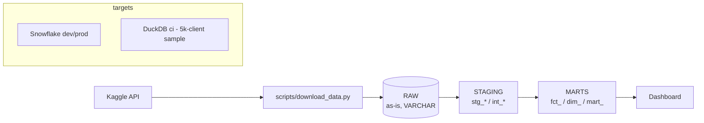

# credit-risk-pipeline

Production-style credit risk data pipeline built on the public
[Home Credit Default Risk](https://www.kaggle.com/competitions/home-credit-default-risk) dataset.

**Stack:** Snowflake (dev/prod) - dbt - Airflow - DuckDB (CI) - Python - GitHub Actions.

> Status: **Phase 1 of 4** - repository structure, data download, RAW layer load.
> Later phases: dbt models and tests, orchestration, CI/CD and docs, dashboard.

## Architecture (target)



## Repository layout

| Path | Purpose |
|---|---|
| `credit_risk_pipeline/` | Shared Python code (table registry, config, connections) |
| `scripts/` | CLI entry points: download, sample, load, Snowflake setup |
| `dbt/` | dbt project and `profiles.yml` (targets `dev`, `prod`, `ci`) |
| `orchestration/airflow/` | Airflow DAGs (phase 3) |
| `data/sample/` | Deterministic 5,000-client sample used by CI |
| `docs/` | Data quality findings and design notes |
| `dashboard/` | Dashboard file (BI) |
| `.github/workflows/` | CI (phase 4) |

## Quickstart

```bash
uv venv --python 3.12 .venv && source .venv/bin/activate   # or: .venv\Scripts\activate
uv pip install -r requirements.txt
cp .env.example .env                                        # fill in values

# 1. Download the raw dataset (requires Kaggle credentials, see below)
python scripts/download_data.py

# 2. Build the deterministic CI sample (commit data/sample/)
python scripts/make_sample.py

# 3a. CI target: load the sample into DuckDB
python scripts/load_raw.py --target ci

# 3b. Snowflake: run scripts/snowflake_setup.sql once (ACCOUNTADMIN), then
python scripts/load_raw.py --target dev
```

### Kaggle access

1. Create an API token at Kaggle > Settings > API and save it as `~/.kaggle/kaggle.json`
   (or export `KAGGLE_USERNAME` / `KAGGLE_KEY`).
2. **Accept the competition rules** on the competition page (Rules tab > "I Understand and Accept").
   Without this the API answers 403 even with valid credentials.

### Snowflake access

Set the `SNOWFLAKE_*` variables from `.env.example`. Key-pair authentication is recommended
because password-only logins are being phased out on Snowflake accounts. No credential is ever
stored in the repository; `dbt/profiles.yml` reads everything from environment variables.

## Data model layers

| Layer | Schema | Contract |
|---|---|---|
| RAW | `RAW` | Source files loaded as-is: every column `VARCHAR`, plus `_loaded_at`, `_source_file`. Reloaded atomically. |
| STAGING | `STAGING` | Typed, renamed, deduplicated views (`stg_*`, `int_*`). |
| MARTS | `MARTS` | Business-ready facts, dimensions and risk marts. |

## Development

```bash
ruff check . && ruff format --check .
pytest
```
